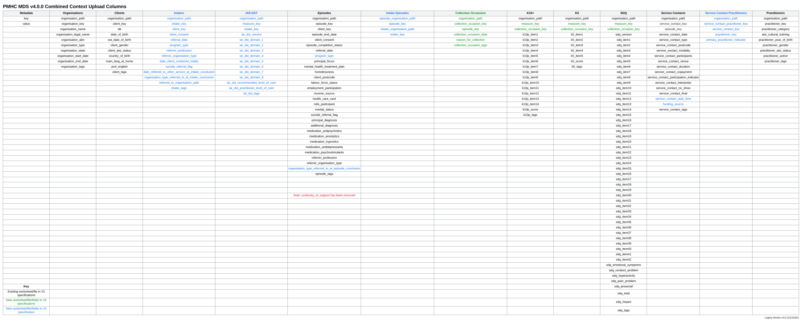

.. _changes-from-v2:

Changes and Upgrading from Version 2
====================================

Version 4.0 introduces the recording of intake related activity (including
activity for the Head to Health and AMHC programmes) in the PMHC MDS as part
of the core  specification.

There are three contexts where data can be submitted using the version 4 specification:

* Intake teams
* Treatment organisations
* Combined Intake/Treatment organisations

Please refer to
:ref:`introduction-contexts` for further information about these contexts.

.. _data-specification-changes:

Data Specification Changes
--------------------------

A summary of the changes between the PMHC MDS Version 2.0 and
PMHC MDS Version 4.0 data specifications are as follows:

* Version 4.0 introduces the concept of an :ref:`key-concepts-intake`
* In order to support the Intake concept three records have been added:

  * For the Intake context - :ref:`intake-data-elements`, :ref:`iar-dst-data-elements`
  * For the Treatment context - :ref:`intake-episode-data-elements`
  * All three records are required in the combined Intake/Treatment context
* The data model has been upgraded to allow multiple practitioners to be
  associated with a :ref:`service-contact-data-elements`. To support this an
  extra record, :ref:`service-contact-practitioner-data-elements` has been
  introduced.
* The following new fields will be added to the Episode record:

  * :ref:`dfn-program_type`
  * :ref:`dfn-organisation_type_referred_to_at_episode_conclusion`

* The following field has been retired from the Episode record:

  * Continuity of Service

* The `8: Psychosocial Support` response has been removed from the
  :ref:`dfn-principal_focus`. Psychosocial intakes and episodes should now be
  reported using the `Psychosocial` response on :ref:`dfn-program_type` on the
  Intake and Episode.

* The following new fields will be added to the Service Contact record:

  * :ref:`dfn-service_contact_start_time`
  * :ref:`dfn-funding_source`

* Version 4 uses the same collection occasion and measures model as the
  Version 3 HeadtoHelp and Wayback extensions.

  Collection occasion and measures data has been separated into separate
  collection occasion and measures records and upload files/worksheets so
  that multiple measures can be collected at a single collection occasion.
  The Collection Occasion record retains the Episode Key, Date and Reason for
  Collection. Separate records exist for the K10+, K5 and SDQ measures.
  Each of these measures records contain the Collection Occasion Key, a
  Measure Key, and item/subscale/total scores for the particular measure.

  In order to support both Version 2 and Version 3 data specifications, the
  PMHC MDS has been converting data uploaded using the Version 2 upload format
  to be stored in the Version 3 format. In order to do this, the PMHC MDS
  has been creating Measure Keys for any Version 2 supplied data. These look like
  random uuid strings and can be viewed through the Data Entry interface or
  by downloading the data in a non Version 2 format.

  *As the PMHC MDS has been auto creating Measure Keys, in order to upgrade
  from Version 2 uploads to Version 4 uploads some work will be involved to
  ensure that, for existing data, the Measure Keys supplied in the Version 4
  upload, matches the Measure Keys already stored in the PMHC MDS. Please
  refer to* :ref:`steps-required-to-upgrade` *below for an explanation of the
  different options available.*

.. _upload-specification-changes:

Upload Specification Changes
----------------------------

The Version 2.0 specification allowed the following worksheets and columns:

.. figure:: figures/v2.0.0-upload-columns.svg
   :alt: PMHC MDS Version 2.0.0 upload columns

   PMHC MDS Version 2.0.0 upload columns

The Version 4 specification allows for different files/worksheets to be uploaded depending on
whether the organisation is an Intake team, Treatment Service Provider or
a combined Intake/Treatment Service Provider. Please refer to
:ref:`introduction-contexts` for further information about these contexts.

The following table shows the Version 4.0 combined Intake/Treatment Service
Provider specification and notes the differences between the Version 2
specification:

   PMHC MDS Version 4.0.0 combined context upload columns

.. _mapping-refer-out-org-types-to-intakes:

Mapping HeadtoHelp Episode - Referral Out Organisation Type to Organisation Type Referred to at Intake Conclusion
-----------------------------------------------------------------------------------------------------------------

During the migration to Version 4 and when HeadtoHelp specifcation files are
uploaded during the period when both HeadtoHelp and Version 4 specification files
are accepted by the PMHC MDS, the `HeadtoHelp Episode - Referral Out Organisation Type <https://docs.pmhc-mds.com/projects/data-specification-headtohelp/en/v3/data-specification/data-model-and-specifications.html#headtohelp-episode-referral-out-organisation-type>`__
will be mapped to :ref:`dfn-organisation_type_referred_to_at_intake_conclusion` as follows:

+----+-----------------------------------------------------+----+--------------------------------------------------------------+
|    | HeadtoHelp Episode - Referral Out Organisation Type |    | Organisation Type Referred to at Intake Conclusion           |
+====+=====================================================+====+==============================================================+
| 0  | None/Not applicable                                 | 97 | No Referral                                                  |
+----+-----------------------------------------------------+----+--------------------------------------------------------------+
| 1  | General Practice                                    | 1  | GP/Medical Practitioner                                      |
+----+-----------------------------------------------------+----+--------------------------------------------------------------+
| 2  | Medical Specialist Consulting Rooms                 | 41 | Medical specialist                                           |
+----+-----------------------------------------------------+----+--------------------------------------------------------------+
| 3  | Private practice                                    | 3  | Psychiatric/mental health service or facility                |
+----+-----------------------------------------------------+    |                                                              |
| 4  | Public mental health service                        |    |                                                              |
+----+-----------------------------------------------------+----+--------------------------------------------------------------+
| 5  | Public Hospital                                     | 2  | Hospital                                                     |
+----+-----------------------------------------------------+    |                                                              |
| 6  | Private Hospital                                    |    |                                                              |
+----+-----------------------------------------------------+    |                                                              |
| 7  | Emergency Department                                |    |                                                              |
+----+-----------------------------------------------------+----+--------------------------------------------------------------+
| 8  | Community Health Centre                             | 5  | Other community/health care service                          |
+----+-----------------------------------------------------+----+--------------------------------------------------------------+
| 9  | Drug and Alcohol Service                            | 4  | Alcohol and other drug treatment service                     |
+----+-----------------------------------------------------+----+--------------------------------------------------------------+
| 10 | Community Support Organisation NFP                  | 11 | Community support groups/agencies                            |
+----+-----------------------------------------------------+----+--------------------------------------------------------------+
| 11 | Indigenous Health Organisation                      | 21 | Indigenous service (non-AOD)                                 |
+----+-----------------------------------------------------+----+--------------------------------------------------------------+
| 12 | Child and Maternal Health                           | 29 | Maternal and Child Health Service                            |
+----+-----------------------------------------------------+----+--------------------------------------------------------------+
| 13 | Nursing Service                                     | 30 | Community nursing service                                    |
+----+-----------------------------------------------------+----+--------------------------------------------------------------+
| 14 | Telephone helpline                                  | 14 | Telephone & online services/referral agency e.g. direct line |
+----+-----------------------------------------------------+    |                                                              |
| 15 | Digital health service                              |    |                                                              |
+----+-----------------------------------------------------+----+--------------------------------------------------------------+
| 16 | Family Support Service                              | 32 | Family support service (excl family violence)                |
+----+-----------------------------------------------------+----+--------------------------------------------------------------+
| 17 | School                                              | 18 | School/other education or training institution               |
+----+-----------------------------------------------------+    |                                                              |
| 18 | Tertiary Education institution                      |    |                                                              |
+----+-----------------------------------------------------+----+--------------------------------------------------------------+
| 19 | Housing service                                     | 13 | Housing and homelessness service                             |
+----+-----------------------------------------------------+----+--------------------------------------------------------------+
| 20 | Centrelink                                          | 12 | Centrelink or employment service                             |
+----+-----------------------------------------------------+----+--------------------------------------------------------------+
| 21 | Other                                               | 98 | Other                                                        |
+----+-----------------------------------------------------+----+--------------------------------------------------------------+
| 22 | HeadtoHelp Hub                                      | 44 | HeadtoHelp / HeadtoHealth                                    |
+----+-----------------------------------------------------+----+--------------------------------------------------------------+
| 23 | Non HeadtoHelp Hub PHN funded service               | 43 | Other PHN funded service                                     |
+----+-----------------------------------------------------+----+--------------------------------------------------------------+
| 99 | Not stated                                          | 99 | Not stated/Inadequately described                            |
+----+-----------------------------------------------------+----+--------------------------------------------------------------+

.. _steps-required-to-upgrade:

Steps required to upgrade to Version 4 uploads
----------------------------------------------

1. Upgrade your Client Management System to export files in the new Version 4 format
2. As explained above, in order to support both Version 2 and Version 3 uploads
   the PMHC MDS has been auto creating measure keys where data is supplied in
   the Version 2 format. Also, during the migration to Version 4,
   Service Contact Practitioner Keys will be auto generated.

   In order to update existing measure data and Service Contact Practitioner data, when
   uploading in Version 4, the existing measure key or service contact practitioner
   key will need to be supplied, otherwise a separate measure or service
   contact practitioner record will be created.

   Where data has been uploaded using a previous specification organisations will
   need to do one of the following:

  * Download their data from the PMHC MDS and sync their local
    measure/service contact practitioner keys
    with the keys that were auto created by the PMHC MDS
  * Download their data from the PMHC MDS, delete the existing
    measures/service contact practitioner records, re-upload with new keys
  * Download their data from the PMHC MDS, create a mapping document containing
    the measure/service contact practitioner key as stored in the PMHC MDS and the local key.
    Email support@pmhc-mds.com and request that the keys are updated
    according to the mapping.
