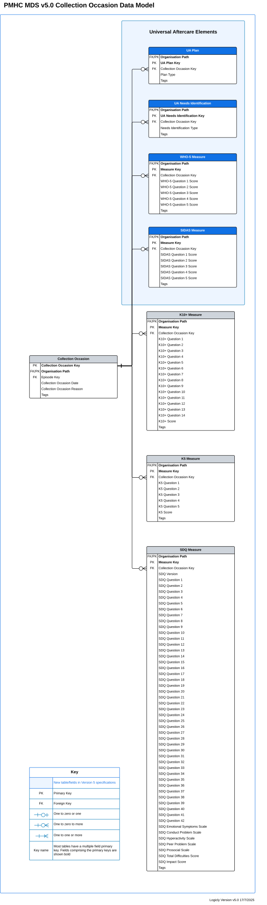

.. _data-model-and-specifications:

Data model and specifications
=============================

.. _data-model:

Data model
----------

There are three contexts where data can be submitted using the version 4
specification:

1. Intake teams
2. Treatment organisations
3. Combined Intake/Treatment organisations

Different records in the specification are intended to be used in each of
these contexts.

Within the PMHC-MDS system a single intake team and individual
service providers/treatment organisations will each have their own organisation
path and report data against those organisations.

Below is the combined Intake/Treatment data model. If an Intake only or
Treatment only organisation is submitting data, a sub set of this data model
may be submitted. Please refer to :ref:`introduction-contexts` for data models
of the different contexts that may be submitted.

.. _data-model-diagram:

.. figure:: figures/data-model-v5.0-combined.svg
   :alt: PMHC MDS Version 5.0 combined data model

   PMHC MDS Version 5.0 combined data model

.. note::
  * The above data model diagram is in the SVG format and can be enlarged 
    or zoomed by opening in a new tab or window or by downloading it.

.. _collection-occasion-diagram:

   PMHC MDS Version 5.0 Collection Occasion data model

.. note:: See :ref:`data-model-diagram` for more details about how
   Collection Occasion records fit into the overall structure.

.. _key-concepts:

Key concepts
------------

.. _key-concepts-primary-health-network:

Primary Health Network
^^^^^^^^^^^^^^^^^^^^^^

Primary Health Networks (PHNs) have been established by the Australian Government
with the key objectives of increasing the efficiency and effectiveness of
medical services for patients, particularly those at risk of poor health
outcomes, and improving coordination of care to ensure patients receive the
right care in the right place at the right time.

.. _key-concepts-provider-organisation:

Provider Organisation
^^^^^^^^^^^^^^^^^^^^^

The Provider Organisation is the business entity that the PHN has commissioned
to provide the service.

See :ref:`provider-organisation-data-elements` for the data elements for a provider organisation.

.. _key-concepts-site:

Site
^^^^

Some Provider Organisations provide services to clients at multiple locations. In the PMHC MDS a site
is a particular location at which a Provider Organisation provides a service to a client.

.. _key-concepts-practitioner:

Practitioner
^^^^^^^^^^^^

The Practitioner is the person who is delivering the service. Multiple
practitioners can deliver a service.

See :ref:`practitioner-data-elements` for the data elements for a practitioner.

.. _key-concepts-client:

Client
^^^^^^

The Client is the person who is receiving the service.

See :ref:`client-data-elements` for the data elements for a client.

.. _active-client:

Active Client
"""""""""""""

An **active client** is a client who has had one or more :ref:`Active Episodes <active-episode>`
in a reference reporting period.

.. _key-concepts-intake:

Intake
^^^^^^

For the purpose of the PMHC MDS, an *Intake* is defined as a point of contact
between a client and a PHN-commissioned organisation where the client is
assessed to determine the appropriate level of care and referred to a
service provider to provide clinical care. An Intake may include the
collection of an IAR-DST measure.

The collection of Intake and IAR data may not be required for all programs.
Please see :ref:`intake-data-elements`.

.. _concluded-intake:

Concluded Intake
"""""""""""""""""

Concluded intakes are intakes where
:ref:`dfn-organisation_type_referred_to_at_intake_conclusion` is **not** blank.

.. _dispatch:

Dispatch
""""""""

A dispatch is a referral from an intake to a treatment organisation. It's called
a dispatch to distinguish it from the referral that triggers a client's entry 
into the system (which happens either through an intake or an episode and can be 
recorded on both records). There can be more than one dispatch per intake 
from the intake organisation but an episode can only ever receive a single dispatch.

.. _key-concepts-intake-episode:

Intake Episode
^^^^^^^^^^^^^^

The Intake Episode record links an Intake record and an Episode record. It
must be provided by the organisation that delivers the episode, not the intake.

.. _key-concepts-episode:

Episode
^^^^^^^

For the purposes of the PMHC MDS, an *Episode of Care* is defined as a more or
less continuous period of contact between a client and a PHN-commissioned
provider organisation/clinician that starts at the point of first contact, and
concludes at discharge. Episodes comprise a series of one or more Service
Contacts. This structure allows for a logical data collection protocol that
specifies what data are collected when, and by whom. Different sets of PMHC MDS
items are collected at various points in the client’s engagement with the
provider organisation. Some items are only collected once at the episode level,
while others are collected at each *Service Contact*.

Four business rules apply to how the *Episode of Care* concept is implemented
across PHN-commissioned services:

- **One Intake may be associated with each episode.** An episode is not
  required to be associated with an Intake.

- **One episode at a time for each client, defined at the level of the provider
  organisation.**

  While an individual may have multiple *Episodes of Care* over the course of
  their illness, they may be considered as being in only one episode at any
  given point of time for **any particular PHN-commissioned provider
  organisation**. The implication is that the care provided by the
  organisation to an individual client at any point in time is subject to only
  one set of reporting requirements.

- **Episodes commence at the point of first contact.** The episode start date
  will be derived from the first service contact regardless of no show state
  as long as there is a service contact that isn't a no show. Therefore, if
  there is no attended service contact the episode is uncommenced.

  Some examples:

  * If a service contact occurs on the 1/1/2018 that is recorded as a no show
    then the episode is uncommenced.
  * If a service contact occurs on the 1/1/2018 that is recorded as a no show
    and another service contact occurs on the 2/1/2018 that is attended then
    the episode start date is derived as 1/1/2018.

- **Discharge from care concludes the episode**

  Discharge may occur clinically or administratively in instances where contact
  has been lost with the client. A new episode is deemed to commence if the
  person re-presents to the organisation.

See :ref:`episode-data-elements` for the data elements for a episode.

.. _open-episode:

Open Episode
""""""""""""

Open episodes are those with :ref:`dfn-episode_completion_status` recorded
as open (Response item 0).

.. _closed-episode:

Closed Episode
""""""""""""""

Closed episodes are those with :ref:`dfn-episode_completion_status`
recorded using one of the 'Episode closed' responses (Response items 1-6).

.. _active-episode:

Active Episode
""""""""""""""

An **active episode** is an episode with one or more
:ref:`Attended Service Contacts <attended-contact>` recorded in a reference
reporting period.

.. _key-concepts-ua-episode:

UA Episode
^^^^^^^^^^

UA Episode is the record format for collecting Universal Aftercare episode data.

See :ref:`ua-episode-data-elements` for the data elements for UA Episode.

.. _key-concepts-service-contact:

Service Contact
^^^^^^^^^^^^^^^

- Service contacts are defined as the provision of a service by one or more PHN
  commissioned mental health service provider(s) for a client where the nature of
  the service would normally warrant a dated entry in the clinical record of
  the client.
- A service contact must involve at least two persons, one of whom must be a
  mental health service provider.
- Service contacts can be either with the client or with a third party, such as
  a carer or family member, and/or other professional or mental health worker,
  or other service provider.
- Service contacts are not restricted to face‑to‑face communication but can
  include telephone, internet, video link or other forms of direct
  communication.
- Service provision is only regarded as a service contact if it is relevant to
  the clinical condition of the client. This means that it does not include
  services of an administrative nature (e.g. telephone contact to schedule an
  appointment).

  Definition based on METeOR: `493304
  <http://meteor.aihw.gov.au/content/index.phtml/itemId/493304>`_ with
  modification.

.. _attended-contact:

Attended Service Contact
""""""""""""""""""""""""

An attended service contact is one that is not marked as 'No show'.

See :ref:`service-contact-data-elements` for the data elements for a service contact.

.. _key-concepts-service-contact-practitioner:

Service Contact Practitioner
^^^^^^^^^^^^^^^^^^^^^^^^^^^^

A Service Contact Practitioner is a Practitioner who provides clinical 
support to a client during a specific Service Contact. More than one 
Practitioner can be involved in a single contact, and there can, and 
typically will, be different combinations of Service Contact 
Practitioners for different Service Contacts throughout a single Episode. 
A particular Practitioner must be personally involved to be counted as 
a Service Contact Practitioner so a case manager or care co-ordinator, 
for example, who has overall responsibility for a client's treatment 
but is not personally involved with a specific contact is not a Service 
Contact Practitioner.

Service Contacts can have more than one Practitioner. They should be 
individually listed by a Practitioner Key in Service Contact Practitioner 
records. One (and only one) practitioner must be identified as the primary 
practitioner in the set of Service Contact Practitioner records that apply 
to the same Service Contact.

See :ref:`service-contact-practitioner-data-elements` for the data
elements for a service contact practitioner.

.. _key-concepts-collection-occasion:

Collection Occasion
^^^^^^^^^^^^^^^^^^^

A Collection Occasion is defined as an occasion during an Episode of Care when
specific Service Activities are required to be collected. At a minimum,
collection is required at both Episode Start and Episode End, but may be more
frequent if clinically indicated and agreed by the client.

Measures will be the Kessler Psychological Distress Scale K10+ (in the case of
Aboriginal and Torres Strait Islander clients, the K5) as well as the Strengths
& Difficulties Questionnaires.

See :ref:`collection-occasion-data-elements` for the data elements for a
collection occasion.

.. _key-concepts-ua-critical-incident:

UA Critical Incidents
^^^^^^^^^^^^^^^^^^^^^

A Critical Incident is a suicide attempt, suicide death or death by any
other means of a client during the episode.

.. _key-concepts-ua-needs-identification:

UA Needs Identification
^^^^^^^^^^^^^^^^^^^^^^^

A Support Plan must be completed with a client within two weeks of their first
attended Service Contact. Creating a support plan requires working with the
client to identify their needs. This is to build an understanding of what
will be of benefit and help form the goals of their Support Plan. These
identified needs will fall into one of the categories listed. Multiple needs
may be identified and therefore added.

.. _record-formats:

Record formats
--------------

.. _metadata-data-elements:

Metadata
^^^^^^^^

The Metadata table must be included in file uploads in order to identify
the type and version of the uploaded data.

.. csv-table:: Metadata record layout
   :file: record/metadata.csv
   :header-rows: 1

For this version of the specification the required content is shown in the
following table:

.. include:: shared/metadata-content.rst

----------

.. _provider-organisation-data-elements:

Provider Organisation
^^^^^^^^^^^^^^^^^^^^^

See :ref:`key-concepts-provider-organisation` for the definition of a provider
organisation.

Provider Organisation data is for administrative use within the PMHC MDS
system. It is managed by the PHNs via the PMHC MDS administrative interface,
or upload.

.. csv-table:: Provider Organisation record layout
  :file: record/organisation.csv
  :header-rows: 1

----------

.. _practitioner-data-elements:

Practitioner
^^^^^^^^^^^^

See :ref:`key-concepts-practitioner` for the definition of a practitioner.

Practitioner data is intended to provide workforce planning data for use
regionally by the PHN and nationally by the Department. It is managed by the
provider organisations via either the PMHC MDS administrative interface or
upload.

.. csv-table:: Practitioner record layout
  :file: record/practitioner.csv
  :header-rows: 1

----------

.. _client-data-elements:

Client
^^^^^^

See :ref:`key-concepts-client` for definition of a client.

Clients are managed by the provider organisations via either the PMHC MDS 
administrative interface or upload.

.. csv-table:: Client record layout
   :file: record/client.csv
   :header-rows: 1

----------

.. _intake-data-elements:

Intake
^^^^^^^

See :ref:`key-concepts-intake` for definition of an intake.

The collection of Intake and IAR data is a requirement for Head to Health
programs. This includes the Head to Health Phone Service, centres, satellites
and Pop-Up clinics. PHNs may choose to collect Intake and IAR data for other
non-Head to Health programs using the PMHC-MDS v4 specification, however reporting of
this data remains optional subject to further guidance from the department.

Intakes are managed by the provider organisations via either the PMHC MDS 
administrative interface or upload.

.. csv-table:: Intake record layout
   :file: record/intake.csv
   :header-rows: 1

----------

.. _intake-episode-data-elements:

Intake Episode
^^^^^^^^^^^^^^

See :ref:`key-concepts-intake-episode` for definition of an intake episode.

Intake Episodes are managed by the provider organisations via either the PMHC MDS 
administrative interface or upload.

.. csv-table:: Intake Episode record layout
   :file: record/intake-episode.csv
   :header-rows: 1

----------

.. _episode-data-elements:

Episode
^^^^^^^

See :ref:`key-concepts-episode` for definition of an episode.

Episodes are managed by the provider organisations via either the PMHC MDS 
administrative interface or upload.

.. csv-table:: Episode record layout
   :file: record/episode.csv
   :header-rows: 1

----------

.. _ua-episode-data-elements:

UA Episode
^^^^^^^^^^

See :ref:`key-concepts-episode` for definition of an episode.

UA Episodes are managed by the provider organisations via upload or data entry.

.. csv-table:: UA Episode record layout
  :file: record/ua-episode.csv
  :header-rows: 1

----------

.. _ua-critical-incident-data-elements:

UA Critical Incident
^^^^^^^^^^^^^^^^^^^^

Critical Incidents are managed by the provider organisations via upload or data entry.

.. csv-table:: Critical Incident record layout
  :file: record/ua-critical-incident.csv
  :header-rows: 1

----------

.. _ua-recommendation-out-data-elements:

UA Recommendation Out
^^^^^^^^^^^^^^^^^^^^^

Recommendation Outs are managed by the provider organisations via upload or data entry.

.. csv-table:: Recommendation Out record layout
  :file: record/ua-recommendation-out.csv
  :header-rows: 1

----------

.. _service-contact-data-elements:

Service Contact
^^^^^^^^^^^^^^^

See :ref:`key-concepts-service-contact` for definition of a service contact.

Service contacts are managed by the provider organisations via either the PMHC MDS 
administrative interface or upload.

.. csv-table:: Service contact record layout
   :file: record/service-contact.csv
   :header-rows: 1

----------

.. _service-contact-practitioner-data-elements:

Service Contact Practitioner
^^^^^^^^^^^^^^^^^^^^^^^^^^^^

See :ref:`key-concepts-service-contact-practitioner` for definition of a
service contact practitioner.

Service contacts practitioners are managed by the provider organisations
via either the PMHC MDS administrative interface or upload.

.. csv-table:: Service contact practitioner record layout
   :file: record/service-contact-practitioner.csv
   :header-rows: 1

----------

.. _collection-occasion-data-elements:

Collection Occasion
^^^^^^^^^^^^^^^^^^^

See :ref:`key-concepts-collection-occasion` for definition of a
collection occasion.

Individual item scores will eventually be required, however, it is noted that
in the short term there are issues with collecting individual item scores.
Therefore, as a transitional phase, reporting overall scores/subscales will be
allowed.

Collection occasions are managed by the provider organisations via either the PMHC MDS 
administrative interface or upload.

.. csv-table:: Collection Occasion record layout
   :file: record/collection-occasion.csv
   :header-rows: 1

.. _measure-data-elements:

Measures
^^^^^^^^

.. contents::
   :local:
   :depth: 2

.. _intake_measures:

Measures at Intake
""""""""""""""""""

.. contents::
   :local:
   :depth: 1

.. _iar-dst-data-elements:

IAR-DST
'''''''

The collection of Intake and IAR DST data may not be required for all programs.
Please see :ref:`intake-data-elements`.

Where an Intake is recorded, an associated :ref:`iar-dst-data-elements` should
also be recorded. However, this is not enforced by the PMHC MDS as Intake data
could be collected separately from IAR DST data.

.. note::
   Versions 4.0.0 through 4.0.2 of the PMHC MDS specifiction only described
   version 1 of the IAR DST. This version was to be used only for adults.
   As of PMHC MDS specification v4.0.4 you may supply either v1 or v2 IAR-DST
   versions. IAR DST v2 adds child, adolescent, and older adult adaptions.
   The PMHC MDS implementation of this change is backward compatible with the
   existing IAR DST v1 format as the only difference is the extension of the `IAR-DST
   - Version`_ domain with IAR DST v2 specific values.

   
.. note::
   **Technical implementation guidance**

   The version data element now contains both the version (``1`` or ``2``) and,
   in the case of version 2, a sub-version indicating the age-group specific form
   of the IAR-DST used. i.e. ``child``, ``adolescent``, ``adult``, and ``older-adult``.
   For example a rating generated using the child form must have the version
   set to ``2.child``.

   This approach has been taken for backwards compatibility with v1 to minimise
   the changes required by data providers to extract and supply v2 data to the
   PMHC-MDS for reporting.
   
   Carefully consider how these two related but separate data items are stored
   within local systems. Analysis and reporting of future IAR-DST data may be
   simplified if they are recorded separately in local systems and only combined
   for use during data supply.
   
ADF veteran status was introduced in the `iar-dst.online tool <https://iar-dst.online>`_ in mid July 2025.
It was added in order to expose additional information in the report that the
tool generates. The additional information is a reminder to clinicians
that veterans have additional referral options. Veteran status is not used
to calculate the IAR-DST recommended level of care.

Version 5.0.0 of the PMHC MDS specification introduced the collection of :ref:`dfn-veteran`
for consistancy with the online tool. 

For more information regarding IAR DST v2 see the `official IAR DST v2
specification documentation <https://docs.iar-dst.online/en/v2/>`_.

.. csv-table:: IAR-DST record layout
   :file: record/iar-dst-measure.csv
   :header-rows: 1

.. _episode_measures:

Measures during an Episode
""""""""""""""""""""""""""

.. contents::
   :local:
   :depth: 1

The PMHC MDS requires the use of one of the following three measures:

* **For adults (18+ years)**
  
  * :ref:`Kessler Psychological Distress Scale (K10+) <k10p-data-elements>`
    is the prescribed measure
  *  There is the option to use the :ref:`Kessler 5 (K5) <k5-data-elements>` for
     Aboriginal and Torres Strait Islander people if that is considered more appropriate

* **For children and young people (up to and including 17 years)**

  * The :ref:`Strengths & Difficulties Questionnaires (SDQ) <sdq-data-elements>` is the
    prescribed tool.  The specified versions include the parent-report for 4-10
    years and 11-17 years; and the self-report for 11-17 years.

  .. note::
     For adolescents, clinician-discretion is allowed, and the
     K10+ or K5 may be used, even though the person is under 18 years

The following measures are availble for the Universal Aftercare Program Type:

  * :ref:`Suicide Ideation Attributes Scale (SIDAS) <sidas-data-elements>`
  * :ref:`World Health Organization's Five Well-Being Index (WHO-5) <who5-data-elements>`

The following additional information is also available to be collected for the Universal Aftercare Program Type:

  * :ref:`Universal Aftercare Plan (UA Plan) <ua-plan-data-elements>`
  * :ref:`Universal Aftercare Needs Identification (UA Needs Identification) <ua-needs-identification-data-elements>`

.. _k10p-data-elements:

K10+
''''

As noted above, reporting individual item scores will eventually be required.
In the short term, respondents can either report all 14 item scores or report
the K10 total score as well as item scores for the 4 extra items in the K10+.

`Kessler 10 Plus (K10+) <https://docs.pmhc-mds.com/phn-po-documentation.html#kessler_10_plus>`_ provides a copy of the K10+ and information about scoring.

.. csv-table:: K10+ record layout
   :file: record/k10p-measure.csv
   :header-rows: 1

When the client’s responses to Q1-10 are all recorded as 1 'None of the time',
they are not required to answer questions 11-14. Where a question has not been
answered please select a response of 'Not stated / missing'.

.. _k5-data-elements:

K5
''

As noted above, reporting individual item scores will eventually be required.
In the short term, respondents can either report all 5 item scores or report
the K5 total score.

`Kessler 5 (K5) <https://docs.pmhc-mds.com/phn-po-documentation.html#kessler_5>`_ provides a copy of the K5 and information about scoring.

.. csv-table:: K5 record layout
   :file: record/k5-measure.csv
   :header-rows: 1

.. _sdq-data-elements:

SDQ
'''

As noted above, reporting individual item scores will eventually be required.
In the short term, respondents can either report all 42 item scores or report
the SDQ subscale scores.

`Strengths and Difficulties Questionnaire (SDQ) <https://docs.pmhc-mds.com/phn-po-documentation.html#sdq>`_ provides 
further information about the versions of the SDQ that are mandated for
Australian Specialised and Primary Mental Health Care settings and
about scoring the SDQ.

.. csv-table:: SDQ record layout
   :file: record/sdq-measure.csv
   :header-rows: 1

----------

.. _sidas-data-elements:

SIDAS
'''''

The SIDAS measure is available for episodes delivered under the Universal Aftercare Program Type.

`Suicidal Ideation Attributes Scale (SIDAS) <https://docs.pmhc-mds.com/phn-po-documentation.html#sidas>`_ provides a copy of the SIDAS and information about scoring.

.. csv-table:: SIDAS record layout
  :file: record/sidas-measure.csv
  :header-rows: 1

----------

.. _who5-data-elements:

WHO-5
'''''

The WHO-5 measure is available for episodes delivered under the Universal Aftercare Program Type.

`The World Health Organization-Five Well-Being Index (WHO-5) <https://docs.pmhc-mds.com/phn-po-documentation.html#who5>`_ provides a copy of the SIDAS and information about scoring.

.. csv-table:: WHO-5 record layout
  :file: record/who5-measure.csv
  :header-rows: 1

-----

.. _ua-plan-data-elements:

UA Plan
'''''''

A UA Plan is available for episodes delivered under the Universal Aftercare Program Type.

.. csv-table:: UA Plan record layout
  :file: record/ua-plan.csv
  :header-rows: 1

----------

.. _ua-needs-identification-data-elements:

UA Needs Identification
'''''''''''''''''''''''

UA Needs Identification is available for episodes delivered under the Universal Aftercare Program Type.

.. csv-table:: UA Needs Identification record layout
  :file: record/ua-needs-identification.csv
  :header-rows: 1

----------

.. _definitions:

.. include:: include/definitions.rst

.. _data-specifications-download:

Download Specification Files
----------------------------

Available for software developers designing extracts for the PMHC MDS, please
click the link below to download the PMHC MDS Specification files:

* `Specification zip <_static/pmhcmds-spec-meta.zip>`_

These files conform to the CSV on the Web (CSVW) standard that is defined at https://csvw.org/.

They are used:

* to generate the :ref:`record-formats` and :ref:`definitions` sections of the data specification documentation
* in the first pass of upload validations
