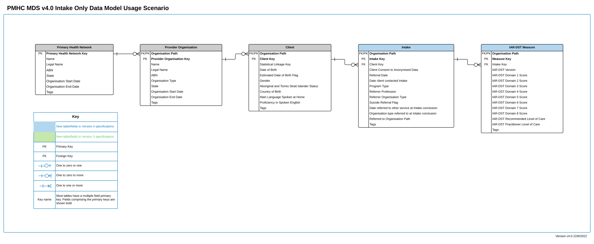
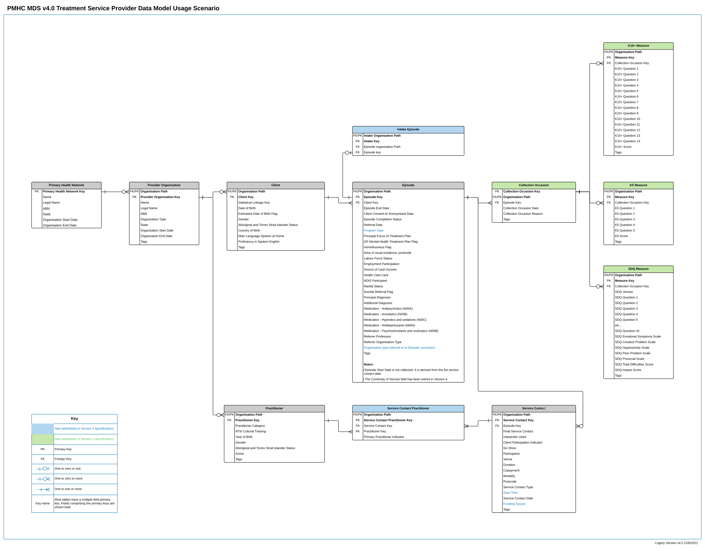
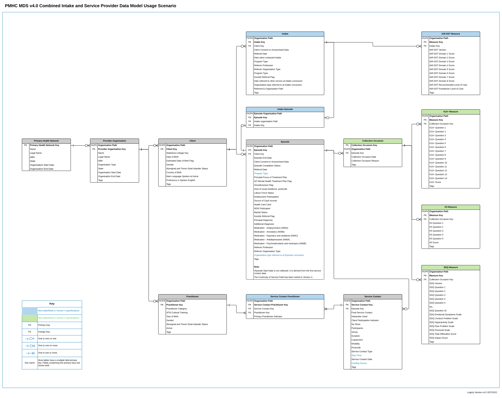

.. _introduction:

Introduction
============

Version 4.0 introduces the recording of intake related activity (including
activity for the Head to Health and AMHC programmes) in the PMHC MDS as part
of the core  specification.

The new version 4 specification comprises 4 entirely new tables, and the
revised collection occasion/measure tables that have been included in the
the Wayback and HeadtoHelp extension specifications.

The new tables are :ref:`intake-data-elements`,
:ref:`iar-dst-data-elements`,
:ref:`intake-episode-data-elements`,
:ref:`service-contact-practitioner-data-elements`.

.. _introduction-contexts:

Contexts
--------

There are three contexts where data can be submitted using the version 4
specification:

1. Intake teams
2. Treatment organisations
3. Combined Intake/Treatment organisations

Different records in the specification are intended to be used in each of
these contexts.

Within the PMHC-MDS system a single intake team and individual
service providers/treatment organisations will each have their own organisation
path and report data against those organisations.

.. _introduction-intake-context:

Intake Context
^^^^^^^^^^^^^^

Where an organisation is only providing intake services and not providing any
treatment services, they can use the following data model to submit data to
the PMHC MDS:

In the Intake context the following records will need to be provided:

* `Client <https://docs.pmhc-mds.com/data-specification/data-model-and-specifications.html#client-data-elements>`_
* :ref:`intake-data-elements`
* :ref:`iar-dst-data-elements`

Episode and Service contact activity is not submitted in this context.

The collection of Intake and IAR data may not be required for all programs.
Please see :ref:`intake-data-elements`.

.. _introduction-treatment-context:

Treatment Service Provider Context
^^^^^^^^^^^^^^^^^^^^^^^^^^^^^^^^^^

Where an organisation is only providing treatment services and not providing any
intake services, they can use the following data model to submit data to
the PMHC MDS:

In the treatment context the specification works almost the same as a
service reporting via the Version 2 core PMHC-MDS specification using the new
:ref:`intake-episode-data-elements` record
to identify additional detail regarding referrals in from the
intake teams (:ref:`dfn-intake_organisation_path` and :ref:`dfn-intake_key`),
referrals out to additional services (:ref:`dfn-organisation_type_referred_to_at_episode_conclusion`), and
the involvement of multiple practitioners in service
contacts (:ref:`service-contact-practitioner-data-elements`) which allows
multiple endorsements.

Intake and IAR-DST activity is not submitted in this context.

.. _introduction-combined-context:

Combined Intake/Treatment Context
^^^^^^^^^^^^^^^^^^^^^^^^^^^^^^^^^

Where an organisation is providing both intake services and
treatment services, they can use the full data model to submit data to
the PMHC MDS:

In the combined context all the records described in both the
:ref:`introduction-intake-context` and :ref:`introduction-treatment-context`
can be submitted.

New Records and Fields in Version 4
-----------------------------------

.. _introduction-intake:

Intake
^^^^^^

The model now records a new :ref:`intake-data-elements` record where an
episode has undertaken an Intake process. The collection of Intake and IAR
data may not be required for all programs. Please see :ref:`intake-data-elements`.

The :ref:`intake-data-elements` table comprises records information about the
intake.

:ref:`dfn-organisation_path` and :ref:`dfn-intake_key` are the
two fields required to link the Intake record at the intake provider organisation
to the Episode record at the treatment organisation.

The values of these fields should be passed along by the intake organisation
to the treatment organisation where the treatment  organisation will use them
to fill in :ref:`dfn-intake_organisation_path` and :ref:`dfn-intake_key`. This will
then link the Intake record at the intake organisation with the Episode
record at the treatment organisation.

.. _introduction-iar-dst:

IAR-DST Measure
^^^^^^^^^^^^^^^

The model now captures the domains and the recommended
level of care pertinent to the IAR-DST that clients have completed for them
as part of the intake process. A new :ref:`iar-dst-data-elements` record
will be created for each intake process.

Consistent with the existing measures in the MDS, the domain scores will be
captured as well as the recommended level of care. The purpose of collecting
both domain scores and recommended level of care is to:

* allow verification of IAR-DST scoring processes, thereby catching scoring
  implementation errors early should they arise, and
* provide a resource that can be used to better understand how the IAR-DST
  scoring algorithm performs in real world environments supporting ongoing
  improvement of the tool.

The collection of Intake and IAR data may not be required for all programs.
Please see :ref:`intake-data-elements`.

.. _introduction-episode:

Episode and Intake Episode
^^^^^^^^^^^^^^^^^^^^^^^^^^

When the client is referred to a PMHC MDS reporting treatment service
 a new :ref:`episode-data-elements` record is created.

Where the client has been referred via an intake process, an
additional :ref:`intake-episode-data-elements` record is also created.

The :ref:`intake-episode-data-elements` table comprises a composite foreign key to link it
back to an episode record on which all the episode information is
recorded. This linkage is done via two fields:

1. The identifier of the intake team (:ref:`dfn-intake_organisation_path`)
2. The episode identifier of the intake team (:ref:`dfn-intake_key`)

The Episode record has been expanded with one new field - the
organisation(s) to which the organisation refers
the client (:ref:`dfn-organisation_type_referred_to_at_episode_conclusion`)

The collection of Intake and IAR data may not be required for all programs.
Please see :ref:`intake-data-elements`.

.. _introduction-service-contact:

Service Contact
^^^^^^^^^^^^^^^

The Service Contact record has been expanded with two new fields:

1. The time that the contact started (:ref:`dfn-service_contact_start_time`).
   This is intended to enable identification of activity undertaken during extended hours.
2. The funding source for the service contact (:ref:`dfn-funding_source`)

.. _introduction-service-contact-practitioner:

Service Contact Practitioner
^^^^^^^^^^^^^^^^^^^^^^^^^^^^

A new record - :ref:`service-contact-practitioner-data-elements` replaces the
Practitioner Key field on the Version 2 Service Contact record.

:ref:`service-contact-practitioner-data-elements` acknowledges the involvement
of multiple practitioners in a service contact. One practitioner (and only one)
must be identified as the primary practitioner.

Data release and confidentiality
--------------------------------

All data collection and reporting requirements are required to comply with
relevant Commonwealth, State and Territory Information Privacy and Health
Records regulations. Clients will be informed that some de-identified portions of the
information collected through the PMHC MDS Service will be utilised
for Commonwealth, State and Territory planning and statistical purposes.
Appropriate consent and ethics approval processes will be adhered to.
