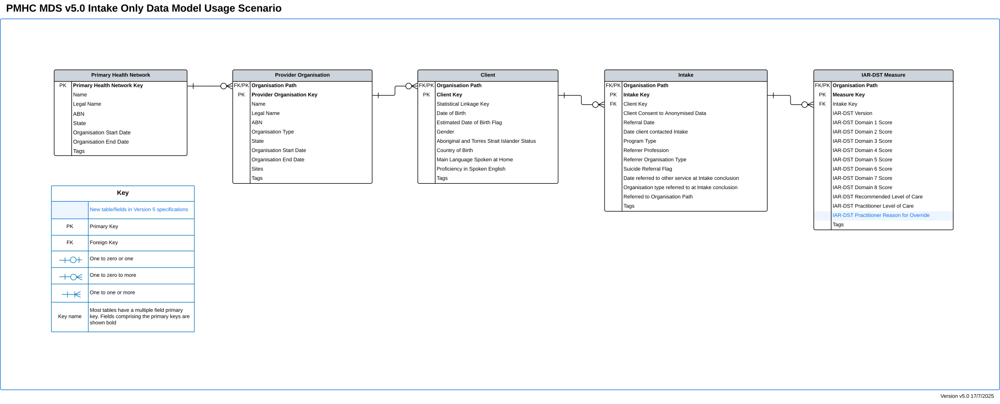
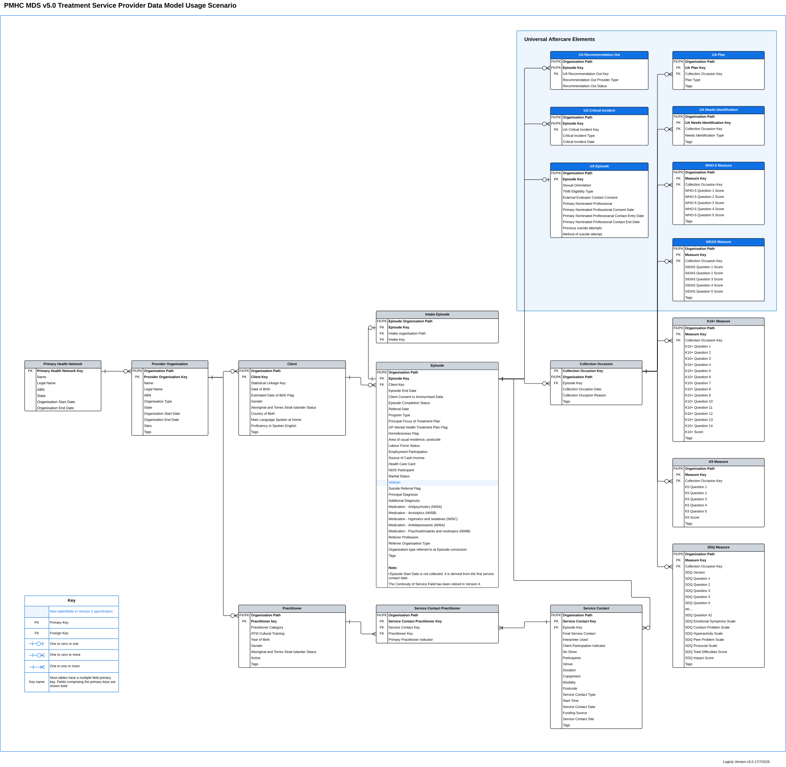
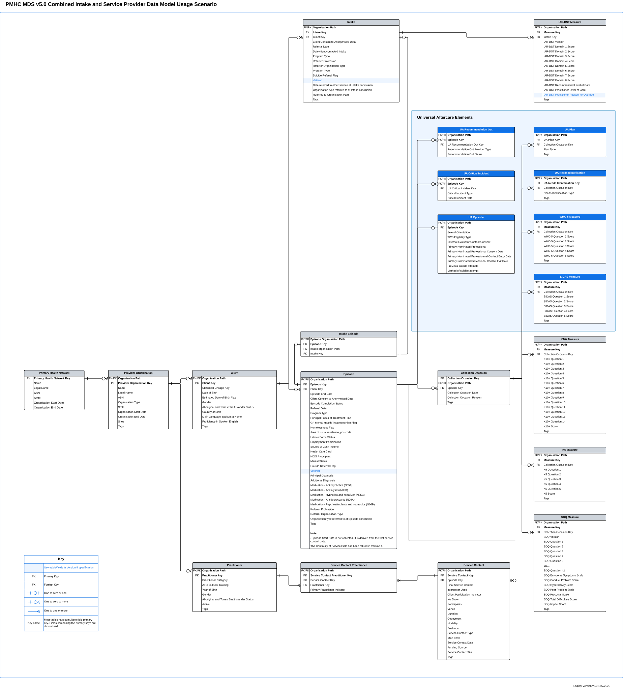

.. _introduction:

Introduction
============

Version 5.0 includes The Way Back as part of the default specification and rebrands it to Universal Aftercare.
Version 5.0 also completes the rebranding of AMHC/HeadtoHealth to Medicare Mental Health Centre (MMHC) by
retiring the AMHC Program Type and renaming the Head to Health Program Type to Head To Health Clinic. 

In order to support Universal Aftercare a `9: Universal Aftercare` response has been added to the
:ref:`dfn-program_type` field on both the Intake and Episode tables.

In addition, seven entirely new tables have been added specifically for Universal Aftercare. 
These tables only need to be submitted where Episodes using the new `9: Universal Aftercare` Program Type are included.

The new tables are:

* :ref:`ua-episode-data-elements`
* :ref:`ua-recommendation-out-data-elements`
* :ref:`ua-critical-incident-data-elements`
* :ref:`ua-plan-data-elements`
* :ref:`ua-needs-identification-data-elements`
* :ref:`sidas-data-elements`
* :ref:`who5-data-elements`

A new :ref:`dfn-veteran` field has been added to the Intake and Episode tables. This field was included in The Way Back specification. 
There is a new IAR-DST varient in development for Veterans. Veterans has been included on the Intake and Episode tables instead of 
the new UA Episode table so that it can be used for monitoring both the IAR-DST and Univeral Aftercare.

A new :ref:`dfn-iar_dst_practitioner_reason_for_override` field has been added to the IAR-DST table.

AMHC and Head to Health have been rebranded as Medicare Mental Health Centres (MMHC). Version 4.1.1 introduced the
`8: MMHC` reponse for :ref:`dfn-program_type`. The following changes have been applied to the :ref:`dfn-program_type` field on both
the Intake and Episode tables:

* `2: Head to Health` renamed to `2: Head to Health Clinic`. This response is only to be used by remaining temporary Head to Health Clinics in NSW and Victoria. Please refer to :ref:`dfn-program_type` for more information.
* `3: AMHC` has been retired. An error will be returned if this response is used.

.. _introduction-contexts:

Contexts
--------

As in the version 4 specification, there are three contexts where data can be submitted using the version 5
specification:

1. Intake teams
2. Treatment organisations
3. Combined Intake/Treatment organisations

Different records in the specification are intended to be used in each of
these contexts.

Within the PMHC-MDS system a single intake team and individual
service providers/treatment organisations will each have their own organisation
path and report data against those organisations.

.. _introduction-intake-context:

Intake Context
^^^^^^^^^^^^^^

Where an organisation is only providing intake services and not providing any
treatment services, they can use the following data model to submit data to
the PMHC MDS:

In the Intake context the following records will need to be provided:

* `Client <https://docs.pmhc-mds.com/data-specification/data-model-and-specifications.html#client-data-elements>`_
* :ref:`intake-data-elements`
* :ref:`iar-dst-data-elements`

Episode and Service contact activity is not submitted in this context.

The collection of Intake and IAR data may not be required for all programs.
Please see :ref:`intake-data-elements`.

.. _introduction-treatment-context:

Treatment Service Provider Context
^^^^^^^^^^^^^^^^^^^^^^^^^^^^^^^^^^

Where an organisation is only providing treatment services and not providing any
intake services, they can use the following data model to submit data to
the PMHC MDS:

In the treatment context the 
:ref:`intake-episode-data-elements` record is used
to identify referrals in from
intake teams (:ref:`dfn-intake_organisation_path` and :ref:`dfn-intake_key`).

Intake and IAR-DST activity is not submitted in this context.

The collection of Universal Aftercare data is only required where organisations are providing the Universal Aftercare program.

.. _introduction-combined-context:

Combined Intake/Treatment Context
^^^^^^^^^^^^^^^^^^^^^^^^^^^^^^^^^

Where an organisation is providing both intake services and
treatment services, they can use the full data model to submit data to
the PMHC MDS:

In the combined context all the records described in both the
:ref:`introduction-intake-context` and :ref:`introduction-treatment-context`
can be submitted.

The collection of Universal Aftercare data is only required where organisations are providing the Universal Aftercare program.

New Records and Fields in Version 5
-----------------------------------

.. _introduction-ua-episode:

UA Episode
^^^^^^^^^^

For information on the UA Episode record please refer to :ref:`key-concepts-ua-episode`.

.. _introduction-ua-recommendation-out:

UA Recommendation Out
^^^^^^^^^^^^^^^^^^^^^

For information on the UA Recommendation Out record please refer to :ref:`ua-recommendation-out-data-elements`.

.. _introduction-ua-critical-incident:

UA Critical Incident
^^^^^^^^^^^^^^^^^^^^

For information on the UA Critical Incident record please refer to :ref:`ua-critical-incident-data-elements`.

UA Plan
^^^^^^^

For information on the UA Plan record please refer to :ref:`ua-plan-data-elements`.

UA Needs Identification
^^^^^^^^^^^^^^^^^^^^^^^

For information on the UA Needs Identification record please refer to :ref:`key-concepts-ua-needs-identification`.

SIDAS
^^^^^

For information on the SIDAS record please refer to :ref:`sidas-data-elements`.

WHO-5
^^^^^

For information on the WHO-5 record please refer to :ref:`who5-data-elements`.

.. _introduction-veteran:

Veteran
^^^^^^^

A new :ref:`dfn-veteran` field has been added to the Intake and Episode tables. This field was included in The Way Back specification. 
There is a new IAR-DST varient in development for Veterans. Veterans has been included on the Intake and Episode tables instead of 
the new UA Episode table so that it can be used for monitoring both the IAR-DST and Univeral Aftercare.

.. _introduction-practitioner-reason-override:

IAR-DST - Practitioner Reason Override
^^^^^^^^^^^^^^^^^^^^^^^^^^^^^^^^^^^^^^

A new :ref:`dfn-iar_dst_practitioner_reason_for_override` has been added to the IAR-DST record.

Data release and confidentiality
--------------------------------

All data collection and reporting requirements are required to comply with
relevant Commonwealth, State and Territory Information Privacy and Health
Records regulations. Clients will be informed that some de-identified portions of the
information collected through the PMHC MDS Service will be utilised
for Commonwealth, State and Territory planning and statistical purposes.
Appropriate consent and ethics approval processes will be adhered to.
