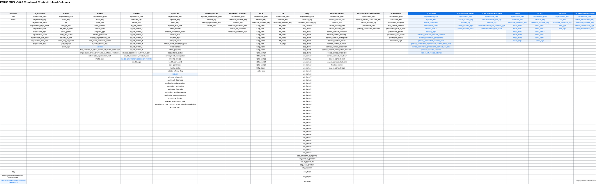

.. _changes-from-v4.1:

Changes and Upgrading from Version 4.1
======================================

Version 5.0 rebrands The Way Back to Universal Aftercare and includes Universal Aftercare
as part of the default specification. Version 5.0
also completes the rebranding of AMHC/HeadtoHealth to Medicare Mental Health Centre (MMHC) by
retiring the AMHC Program Type and renaming the Head to Health Program Type to Head To Health Clinic. 

.. _data-specification-changes:

Data Specification Changes
--------------------------

A summary of the changes between the PMHC MDS Version 4.1 and
PMHC MDS Version 5.0 data specifications are as follows:

* The following changes have been made to support Universal Aftercare:

  - In order to support Universal Aftercare a '9: Universal Aftercare' response has been added to the
    :ref:`dfn-program_type` field on both the Intake and Episode tables.
  - Seven entirely new tables have been added. These tables only need to be submitted where Episodes
    using the new '9: Universal Aftercare' Program Type are included.

    * :ref:`ua-episode-data-elements`,
    * :ref:`ua-recommendation-out-data-elements`,
    * :ref:`ua-critical-incident-data-elements`,
    * :ref:`ua-plan-data-elements`,
    * :ref:`ua-needs-identification-data-elements`,
    * :ref:`sidas-data-elements`,
    * :ref:`who5-data-elements`.

* AMHC and Head to Health have been rebranded as Medicare Mental Health Centres (MMHC). Version 4.1.1 introduced the
  `8: MMHC` reponse for :ref:`dfn-program_type`. The following changes have been applied to the :ref:`dfn-program_type` field on both
  the Intake and Episode tables:

  - '2: Head to Health' renamed to `2: Head to Health Clinic`. This response is only to be used by organisations commissioned by Victorian PHNs. Please refer to :ref:`dfn-program_type` for more information.
  - '3: AMHC' has been retired. An error will be returned if this response is used.

* A new :ref:`dfn-veteran` field has been added to the Episode table. This field was included in The Way Back specification. 
  There is a new IAR-DST varient in development for Veterans. Veterans has been included on the Episode table instead of 
  the new UA Episode table so that it can be used for monitoring both the IAR-DST and Univeral Aftercare.

* A new :ref:`dfn-iar_dst_practitioner_reason_for_override` has been added to the IAR-DST table.

.. _upload-specification-changes:

Upload Specification Changes
----------------------------

The Version 4.1 and 5.0 specifications both allow for different files/worksheets to be uploaded depending on
whether the organisation is an Intake team, Treatment Service Provider or
a combined Intake/Treatment Service Provider. Please refer to
:ref:`introduction-contexts` for further information about these contexts.

The following table shows the Version 5.0 combined Intake/Treatment Service
Provider specification and notes the differences between the Version 4.1
specification:

   PMHC MDS Version 5.0.0 combined context upload columns

Data mapping between Version 4.1 and Version 5.0
------------------------------------------------

*****Fill in*****

.. _steps-required-to-upgrade:

Steps required to upgrade to Version 5.0 uploads
------------------------------------------------

1. Upgrade your Client Management System to export files in the new Version 5.0 format
*****Fill in*****